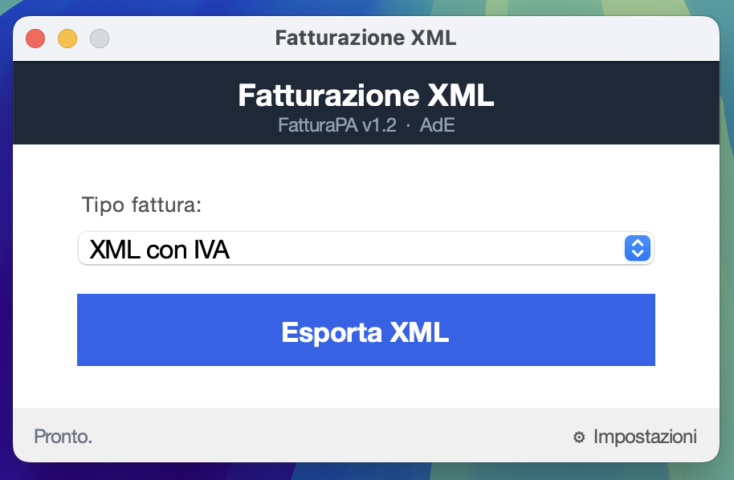
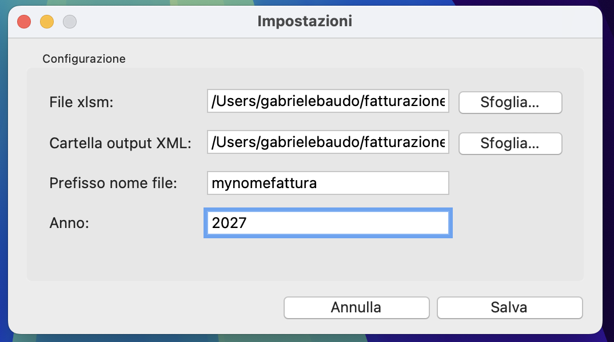

# fatturazione_xml_tool

**Excel for Mac cannot export XML. The AdE requires XML. This fixes that.**

Italian freelancers with partita IVA need FatturaPA v1.2 XML files. Excel on Windows exports them natively via XML Maps. Excel on Mac silently drops that feature. The result: copy-pasting into web tools, chasing encoding errors, or keeping a Windows machine around just to hit "Export."

This tool closes that gap. It reads the XML Maps already defined in your `.xlsm` workbook and produces the correct FatturaPA XML, no Windows required.

 

## Honest scope

This is not a general-purpose FatturaPA generator. It was built for one specific `.xlsm` workbook — mine — with XML Maps already configured to match the FatturaPA v1.2 schema. If your workbook has a similar structure, you may be able to adapt it. If it doesn't, this won't work out of the box.

The key idea: the schema lives in Excel, not in this code. FatturaPA's structure — XPaths, namespaces, field names — is encoded in the XML Maps inside the workbook. This tool reads those maps and follows them. When the Agenzia delle Entrate releases a new template, you update the XML Maps in Excel. No Python changes needed.

## Download

Grab the latest `.app` from the [Releases](https://github.com/gabrielebaudo/fatturazione-xml-tool/releases/latest) page, unzip, and move `FatturazioneXML.app` to `/Applications`.

First launch: macOS will block it because the app isn't notarized. Right-click → Open → Open, or run once from Terminal:

```bash
xattr -cr /Applications/FatturazioneXML.app
```

Then double-click normally from that point on.

## Quick start

**Run in development:**

```bash
cd fatturazione_xml_tool
/opt/homebrew/bin/python3.13 -m fatturazione_xml
```

**Build the .app bundle:**

```bash
pip install py2app
python setup.py py2app
# Result: dist/FatturazioneXML.app
```

First launch: open Settings, point the app at your `.xlsm` file, set the output folder and your `filename_prefix` (e.g. `Fattura_`). Settings persist in `~/Library/Application Support/FatturazioneXML/config.json`.

Output files are named `{prefix}{numinvio+1}.xml`. The counter is read from the cell in the active year sheet and incremented after each successful export.

> **Before exporting:** save the `.xlsm` in Excel first. openpyxl reads cached formula values — export without saving and you get stale data.

## Dependencies

- Python 3.13 via Homebrew: `brew install python-tk@3.13`
- `openpyxl>=3.1.0`
- `py2app>=0.28` (build only)

## Tests

```bash
/opt/homebrew/bin/python3.13 -m unittest discover -v
```

---

MIT License — Gabriele Baudo
